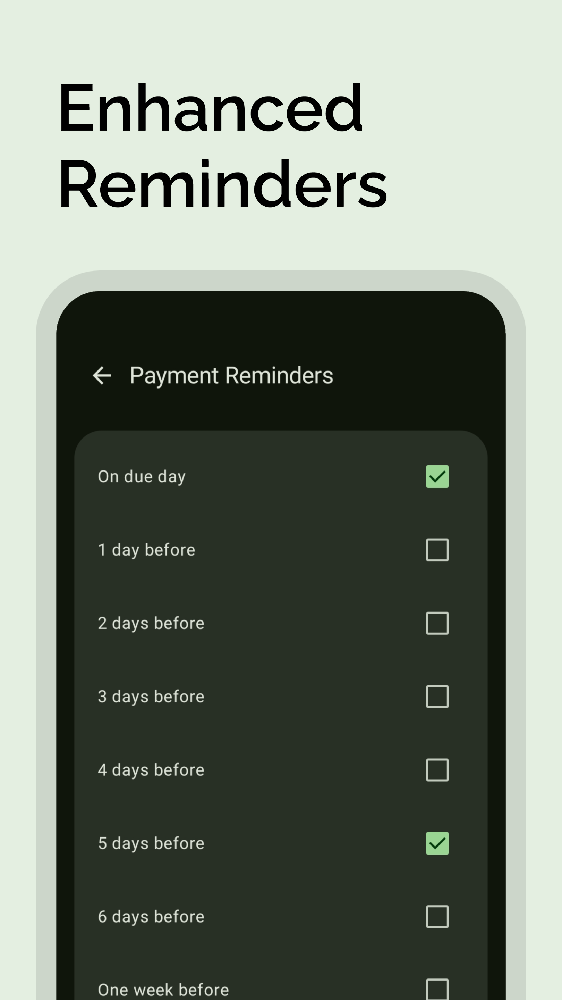
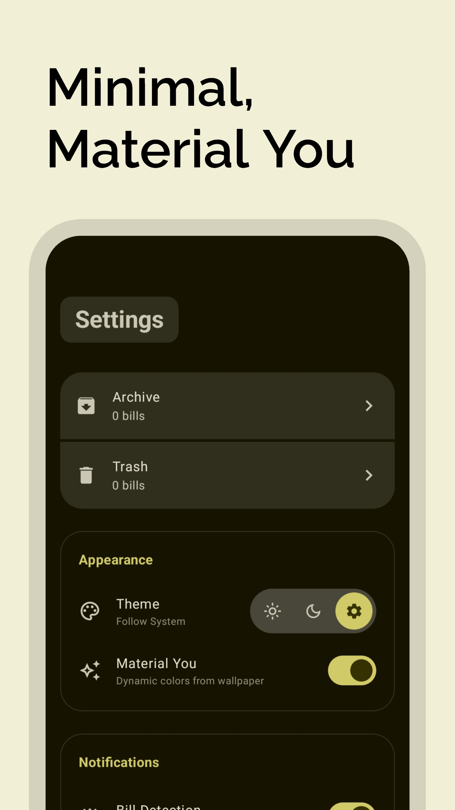

# DueDate

<p align="center">
  
</p>

<p align="center">
  <strong>Smart Bill Tracking. 100% Offline.</strong><br>
  Automated bill detection from SMS with a modern Material You interface.
</p>

<p align="center">
    <a href="https://github.com/MateYou-Apps/DueDate/releases/latest">
        
    </a>
    <a href="https://github.com/MateYou-Apps/DueDate/releases">
        
    </a>
    <a href="https://github.com/MateYou-Apps/DueDate/releases">
        
    </a>
</p>

<p align="center">
  
  
  
  
  
  
  
  
</p>

## Core Features

DueDate is designed to simplify your financial life by automating credit card bill tracking without compromising your privacy.

### ⚡ Smart Automation
- **Auto-Detection:** Effortlessly identifies credit card bills from bank SMS alerts with **global currency support**.
- **Custom Templates:** Unsupported bank sms? Create your own parsing rules using an intuitive visual configuration tool.
- **Partial Payments:** Track partial payments on your bills. Log them without moving the bill to 'Paid' until it's fully settled.
- **Smart Status:** Instantly see which bills are due, late, or paid at a glance with color-coded indicators.

### 📊 Visualize & Remind
- **Concise Calendar:** A beautiful, integrated calendar view to see your upcoming financial commitments for any month.
- **Detailed History:** Monitor spending habits with statement history and interactive spending graphs.
- **Enhanced Reminders:** Set custom notification schedules (5 days, 1 day, and same-day alerts) to ensure you never pay a late fee again.
- **Interactive Widgets:** Keep track of your most urgent bills directly from your home screen.

### 🛡️ Private & Reliable
- **100% Offline:** Zero internet permissions. Your data is parsed and stored locally - never leaving your device.
- **Biometric Security:** Protect your sensitive financial information with an optional app lock using Fingerprint.
- **Material You:** Fully supports dynamic theming. The app adapts to your wallpaper for a personalized aesthetic.
- **Portable Backups:** Export and import backups of your bills, banks, and custom configurations.

<br>


<p align="center">
    <a href="https://nicegist.github.io/a746a7dddc704cb496fd5c938b463926" target="_blank">
        
    </a>
    <a href="https://nicegist.github.io/36bdd11f7050b94b38b1342fff686aa8" target="_blank">
        
    </a>
    <a href="https://nicegist.github.io/a639614b1f3b83c8258dc680335e4dc9" target="_blank">
        
    </a>
</p>


<br>

## Tech Stack

Built with modern Android standards for performance and longevity.

### Architecture & UI
- **Language:** [Kotlin](https://kotlinlang.org/)
- **UI Toolkit:** [Jetpack Compose](https://developer.android.com/jetpack/compose) (Material 3)
- **Architecture:** MVVM (Model-View-ViewModel)
- **Background Tasks:** [WorkManager](https://developer.android.com/topic/libraries/architecture/workmanager) for reliable notifications.

### Data & Integration
- **Local Database:** [Room](https://developer.android.com/training/data-storage/room) (SQLite)
- **Home Screen Widgets:** [Jetpack Glance](https://developer.android.com/jetpack/compose/glance)
- **SVG Rendering:** [AndroidSVG](https://bigbadaboom.github.io/androidsvg/)
- **Serialization:** [Gson](https://github.com/google/gson)

## Credits

### Concept & UI Design
[CardCue](https://play.google.com/store/apps/details?id=com.labs1523.cardcue) by [1523 Labs](https://1523labs.vercel.app/)
> **DueDate** was born out of a profound admiration for CardCue. This app's UI/UX is heavily dependent on their work. In my opinion, CardCue set the standard for aesthetics and user flow. However, as a user, I found myself needing more flexibility - specifically the ability to add custom banks and tailor parsing options to my specific needs. Since those features weren't available in the original app and I had to wait for their developer to add them, I decided to develop DueDate from the ground up. This app is my tribute to that incredible design philosophy, reimagined as a fully customizable, user-centric, and offline-first tool for everyone. A massive thank you to **CardCue**. You may check them out on PlayStore [here](https://play.google.com/store/apps/details?id=com.labs1523.cardcue).

### App Screenshots
- [appmockup](https://app-mockup.com/): For App screenshot mockups

### Icons
- [Material Symbols](https://fonts.google.com/icons): For app icon and various system icons - Under [Apache License Version 2.0](https://www.apache.org/licenses/LICENSE-2.0.html)
- [Lawnicons](https://github.com/lawnchairlauncher/lawnicons): Specialized bank icons - Under [Apache License Version 2.0](https://www.apache.org/licenses/LICENSE-2.0.html)
- [Arcticons](https://github.com/Arcticons-Team/Arcticons): Specialized bank icons - Licensed under [CC BY-SA 4.0](https://creativecommons.org/licenses/by-sa/4.0/)
- [IconKitchen](https://icon.kitchen/): For generating app icons of various required dimensions

### Illustrations
We used high-quality assets from Icons8 to enhance the user experience:
1. [Magnetic Card](https://icons8.com/icon/HTCahqrJ1c2U/magnetic-card) icon by [Icons8](https://icons8.com)
2. [Speech Bubble](https://icons8.com/icon/sSe3Hd3iJIK5/speech-bubble) icon by [Icons8](https://icons8.com)
3. [Push Notifications](https://icons8.com/icon/nbksCyt62mGC/push-notifications) icon by [Icons8](https://icons8.com)
4. [Shield](https://icons8.com/icon/Xvnz23NvQSwk/shield) icon by [Icons8](https://icons8.com)
5. [Open Envelope](https://icons8.com/icon/sqqsKqSsT8q1/open-envelope) icon by [Icons8](https://icons8.com)
6. [Exclamation Mark](https://icons8.com/icon/Gh16YqoXVTxy/exclamation-mark) icon by [Icons8](https://icons8.com)
7. [Circled Play Button](https://icons8.com/icon/YIfLprQJThme/circled-play-button) icon by [Icons8](https://icons8.com)

### AI Collaboration
Code & Logic Architecture - Google Gemini
> This app was developed in collaboration with Google Gemini. From architecting the complex background SMS receivers and on-device parsing logic to refining the Material You UI components, Gemini served as a dedicated pair-programmer. This allowed for the rapid development of a robust, offline-first architecture that prioritizes both performance and user privacy.

## Building Locally
To build DueDate on your machine:

### 1. Prerequisites
- **Android Studio:** Ladybug (2024.2.1) or newer.
- **JDK:** Java 21 toolchain.

### 2. Clone the Repository
```bash
git clone https://github.com/MateYou-Apps/DueDate.git
cd DueDate
```

### 3. Build & Run
1. Open the project in Android Studio.
2. Sync Gradle and click **Run** to deploy to your device.

## License
Licensed under the [GNU General Public License v3.0](LICENSE).
