Welcome to **DueDate**, your privacy-first, fully offline credit card bill tracking assistant. This guide will help you master the app and ensure you never pay a late fee again.

 

> ### Table of Contents
> ▶️  [Quick Start Beginner Guide](#quick-start-beginner-guide)  
> 💳  [App Features](#app-features)  
> 🧮  [Experimental Feature](#experimental-feature---configure-custom-sms-templates)  
> 💬 [Frequently Asked Questions (FAQ)](#frequently-asked-questions-faq)  
> 📝  [Updates to this page](#updates-to-this-page)  
> 📧  [Contact Us](#contact-us)

 

## Quick Start Beginner Guide
Follow these eight steps to get started:
1. **Onboarding**: Upon first launch, swipe through the introductory screens to understand the core philosophy of the app.
2. **Grant Permissions**:  Allow Notification and SMS permissions. SMS access is required to detect bills, and Notifications are required for reminders.
3. **Enable Autostart**: To ensure the app detects bills while closed on your Xiaomi/Redmi/POCO device, you must enable autostart.
4. **Parse Existing Messages**: (Optional) You may choose to scan your existing messages to identify recent bills. Upcoming bills will be automatically detected.
5. **Bills Screen**: Your central hub. Once a bill is detected and added, it will appear here. You may filter these to view bills over a specific duration. Tap on a bill for overview and detailed history.
6. **Marking as Paid**: Tap the 'Mark as Paid' button to move a bill to the 'Paid Bills' section. These can be found at the end of your unpaid bills on the Bills screen.
7. **Calendar Screen**: Your bills for the month, at a glance. Tap on a bill for overview and detailed history.
8. **Settings Screen**: Your Archive and Trash folders can be accessed here. Your app is yours to customize.

  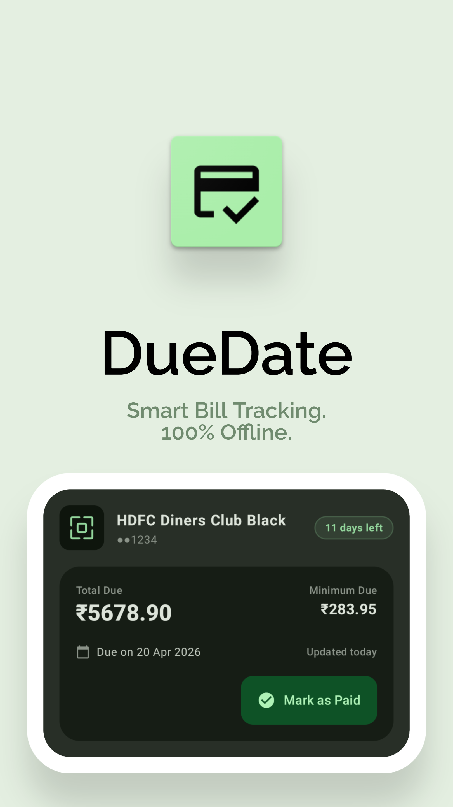
  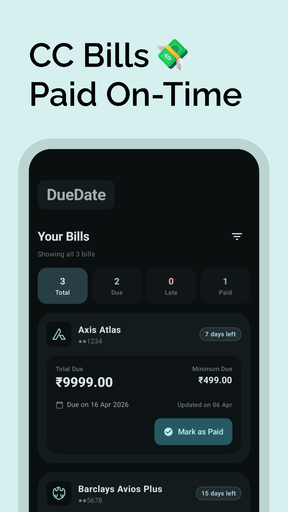
  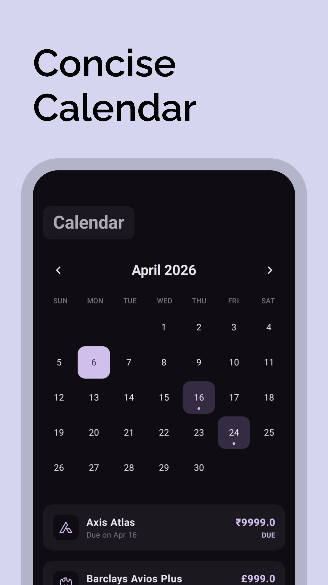
  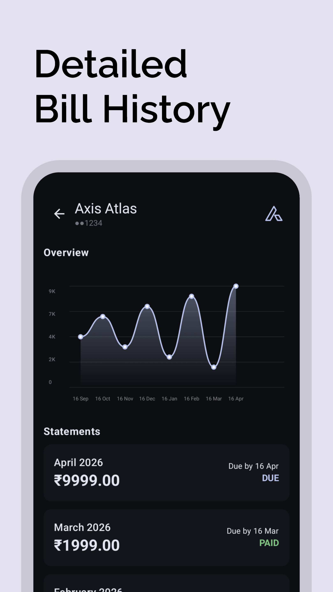
  
  
  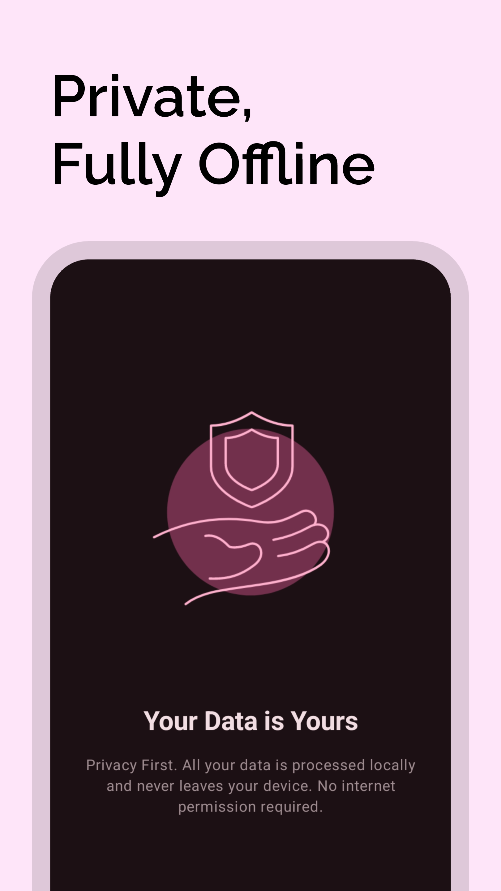
  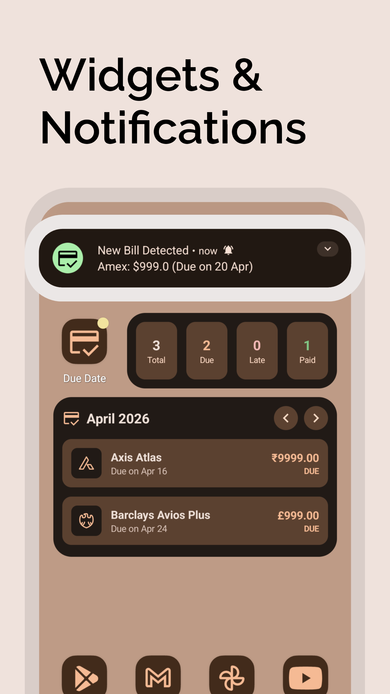

 

---

## App Features

### 1. Understanding Bills and Parsing
DueDate uses a powerful on-device engine to scan incoming bank SMS alerts.
- **Automatic Detection (Real-time Scan)**: When your bank sends a statement alert, DueDate identifies the Bank Name, Amount, and Due Date instantly.
- **Scan Existing SMS (Manual Scan)**: Manually trigger a scan of your message history to find bills you received before installing the app, via `Settings > Database > Parse Existing SMS`. You can scan by message count or date range, upto 50 days in the past. This feature is best used during your first setup and you will be prompted accordingly.
- **Sync Missed Bills (Automated Scan)**: Every time you launch the app, DueDate automatically scans for newer messages received since your last detected bill (if enabled in `Settings > Database > Sync Missed Bills`). This ensures that even if Android killed the app process to save battery, your bills are captured the moment you open DueDate. 
- **Manual Parsing**: Found an old SMS? Copy the text, go to `Settings > Database > Bill Parser`, and paste it. Tap 'Parse Text' to see if the app recognizes it. If the parse is successful, you can hit Add Bill to instantly track it. If the app doesn't recognize the format, use the Configure button to create a custom template for it yourself!
- **Zero or Negative Bills**: Bills with zero or negative due amounts are marked as paid automatically (if enabled in `Settings > Database > Auto-Pay Zero Bills`).
- **Customizing Date Formats**: DueDate allows you to choose how dates are parsed from your bank SMS to match your local preference. Go to `Settings > Database > Date Format` to choose between DD/MM/YYYY (Day first) or MM/DD/YYYY (Month first) formats.

> ℹ️ **NOTE**  
> Text parsing happens on your physical hardware. Your private messages never leave your device.

 

### 2. Understanding Archive and Trash
Manage your bill history without cluttering your main view.
- **Archive**: Older paid bills are automatically archived once a newer bill of the same card is marked as paid (if enabled in `Settings > Database > Auto-Archive Paid Bills`). You can view them in `Settings > Archive` Folder.
- **Trash**: Deleted bills are moved to Trash. They stay here forever unless permanently deleted, allowing you to undo accidental deletions. Duplicate bills detected by the app are automatically moved to trash. You can view them in `Settings > Trash` Folder.
- **Permanent Deletion**: You can empty the Archive or Trash at any time.

 

### 3. Manage Banks and Branded Cards
Customize the app to match your wallet.
- **Supported Banks**: Go to `Settings > Database > Banks` to see a list of built-in institutions.
- **Custom Banks**: Use the "+" button to add a new bank. You need to enter the Sender ID of your bank (i.e., the name of your bank in your SMS inbox). You may even upload a custom SVG logo for your bank.
- **Branded Cards**: Add specific credit cards (e.g., Kiwicard) to distinguish them from standard bank-issued cards.

  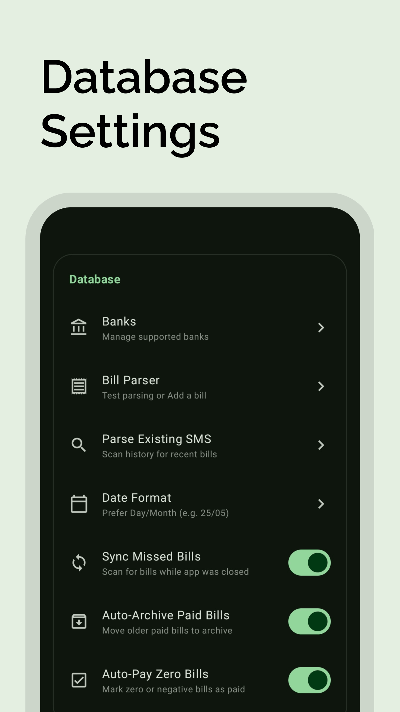
  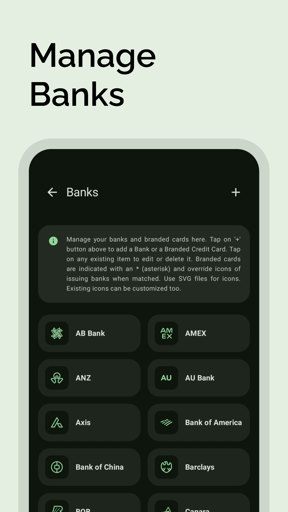
  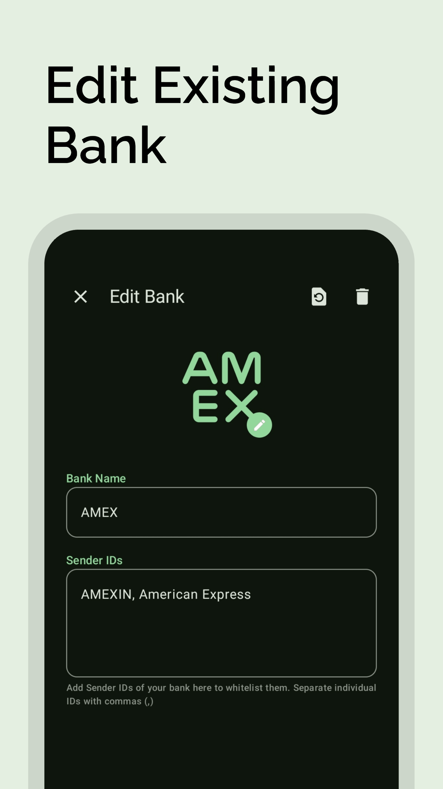
  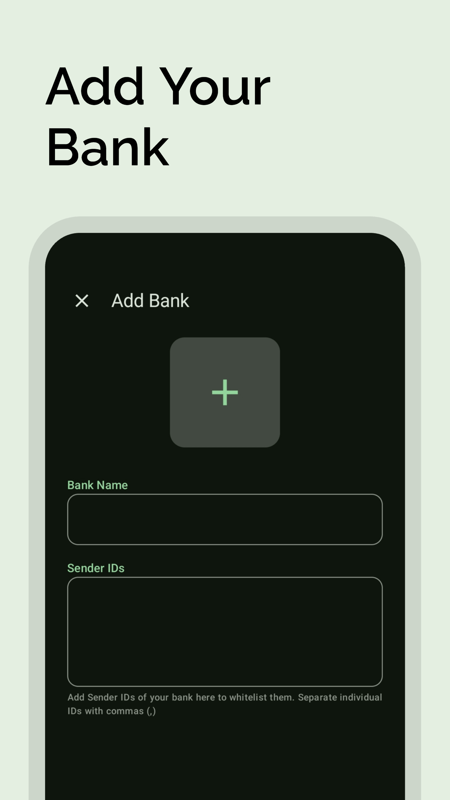

 

### 4. Understanding Payment Reminders
DueDate ensures you are alerted before the late fees kick in.
- **Default Timing**: Reminders are typically sent 5 days before, and on the due date.
- **Customization**: Go to `Settings > Notifications > Frequency` to change how many days in advance you want to be notified.
- **Custom Time**: Set a specific time (e.g., 10:00 AM) for reminders to trigger, in `Settings > Notifications > Frequency > Reminder Time`.

 

### 5. Accessing Diagnostic Logs
For advanced users or troubleshooting.
- **Activity Log**: A general timeline of app events like 'Bill Detected', 'Payment Reminders Set, or "Bill Archived'
- **Receiver Log**: Shows the last 10 raw SMS texts received by the app.
- **Parser Log**: Shows exactly how the app interpreted the last received SMS.
- **Scheduler Log**: Shows a history of when reminders were set and if any were "Skipped" (e.g., if the bill was already paid).

> 💡**TIP**  
> Diagnostics section can be accessed by tapping on `Settings > About` for 5 times.

 

### 6. Enabling Autostart (Xiaomi/Redmi/POCO)
To ensure the app detects bills while closed on your Xiaomi/Redmi/POCO device, you must perform these steps:
1. Long-press the DueDate Icon on your home screen, Tap App Info, Toggle Autostart to ON.
2. Instead, you may open your Device Settings and search for 'Autostart' and toggle DueDate to ON.
3. Battery Saver: Set to 'No Restrictions'.

 

### 7. Using Home Screen Widgets
DueDate offers two powerful widgets that bring your financial overview directly to your home screen.
- **Interactive Summary Widget**: A compact dashboard that provides a real-time view of your Total, Due, Late and Paid Bills. Tapping on any category will launch the app directly into a filtered view of those specific bills.
-  **Monthly Bills Widget**: A compact view of your bills for the month. Use the < and > arrow buttons to navigate through future or past months' bills. Each bill is displayed with its bank logo, name, due date, and a color-coded status.

> 💡**TIP**  
> To add a widget: Long-press any empty space on your phone's home screen, tap Widgets, search for DueDate, and drag your preferred widget to your home screen.

 

### 8. Local Backups
Your data is precious. Since we have no cloud, you own your backups.
- **Export**: Go to `Settings > Backup > Export Data` and choose from the popup displayed. This saves a file consisting the exported bills and/or settings to your phone's storage. Trashed bills are not included in your export file.
- **Import**: Use `Settings > Backup > Import Data` to restore your bills and/or settings if you move to a new phone or after a fresh installation. Your settings will be overwritten by those in the import file and imported bills will be appended to the existing bills.

> 💡**TIP**  
> Save your export file to a personal cloud drive like Google Drive or Proton Drive manually for extra safety.

 

### 9. Deleting All Data
**Want a fresh start?** Go to `Settings > About > Reset App`. This will wipe all bills, bank configurations, and logs from your device. This action cannot be undone.

 

### 10. Disclaimer & Responsibility
While DueDate uses high-precision parsing patterns, it is a tool to *assist* you, not replace your bank's official communications.
- **Verification**: Users are expected to verify extracted data against the original SMS.
- **Liability**: The developer is not responsible for any late fees, interest charges, or financial discrepancies resulting from missed or incorrectly parsed notifications.
- **No Financial Advice**: This app is a tracking utility and does not provide financial or legal advice.

 

---

## Experimental Feature - Configure Custom SMS Templates
The Custom SMS Templates feature is a powerful tool designed for advanced users. It allows you to "teach" DueDate how to read bill alerts from banks or specific formats that the app doesn't natively support yet. By creating a template, you define a custom rule that DueDate will use to automatically detect future bills from that specific sender.

**Here's how the Flow Works** -
1. **Select a Sample**: Copy a bill SMS from your inbox. You can start the configuration from `Settings > Experimental > Configure SMS Templates` or by clicking the Configure button after testing an SMS in the `Settings > Database > Bill Parser` tool.
2. **The Tagging Wizard**: The app breaks your SMS into individual words or "tags." You will go through a step-by-step wizard to identify the following:
    - *Total Due*: Tap the tag representing the total amount you owe.
    - *Minimum Due* (Optional): Tap the tag for the minimum payment, or hit "Skip."
    - *Currency*: Tap every instance of the currency symbol or code (e.g., if "GBP" appears twice, tap both). This ensures the template stays flexible if the currency changes in the future.
    - *Due Date*: Tap the tag(s) that form the date.
    - *Arrange Date*: If your date is made of multiple tags (e.g., "10" "April" "2026"), you will assign them to the Day, Month, and Year slots to help the app understand the format.
    - *Card Identification* (Optional): Tap tags that identify the card name and then the last 4 digits of the card number.
3. **Verify & Preview**: You will see a live preview of a Sample Bill Card. Ensure the extracted amount, currency, and date match the original SMS.
4. **Save & Link**: Give your configuration a name (e.g., "My International Travel Card SMS Format") and pick the associated bank from the list if you want this sample bill to be added alongside your actual bills on the main screen.
5. **Automation**: Once saved, DueDate will instantly recognize any future SMS that matches this pattern, automatically adding the bill to your list and scheduling your reminders!

  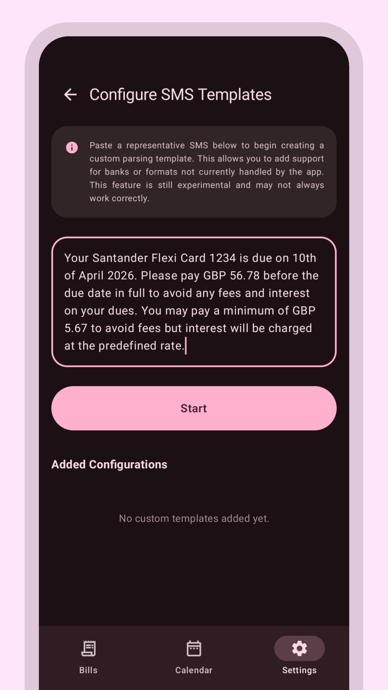
  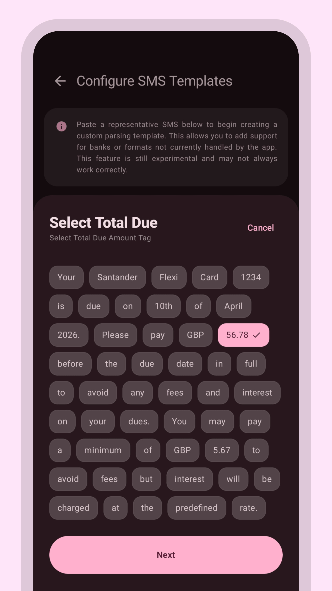
  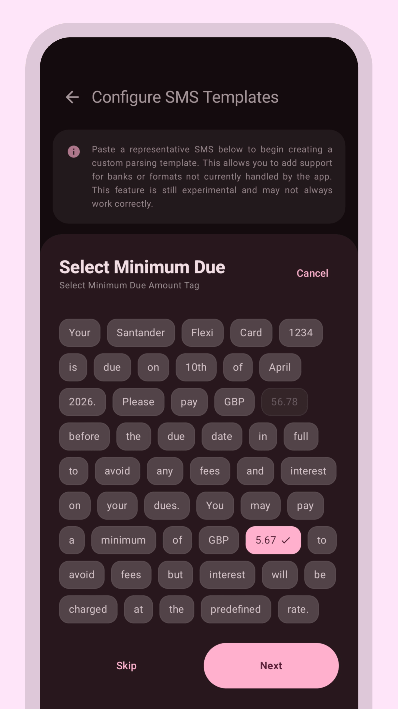
  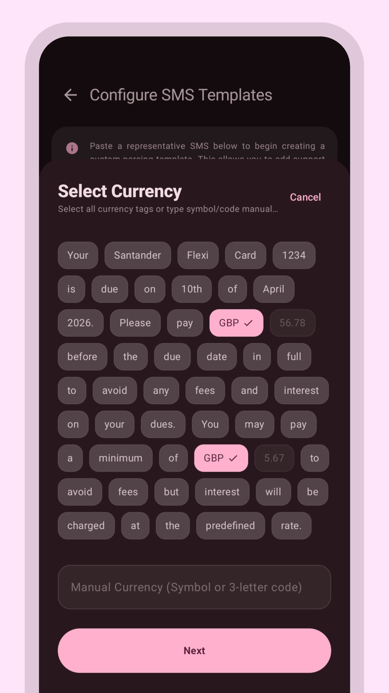
  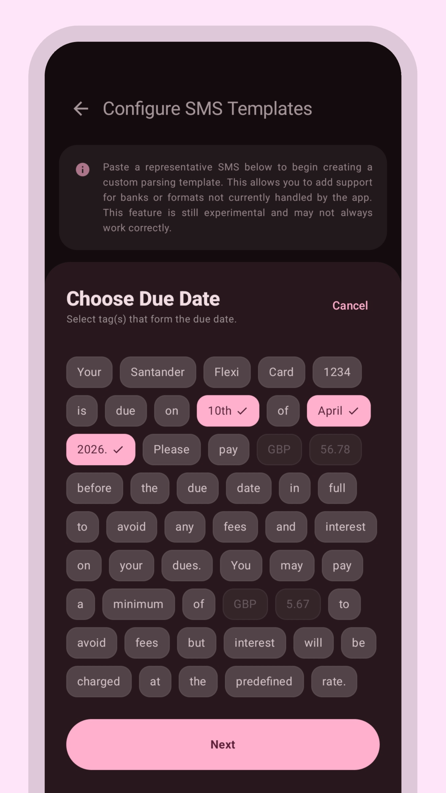
  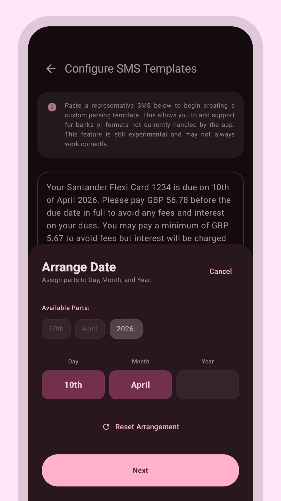
  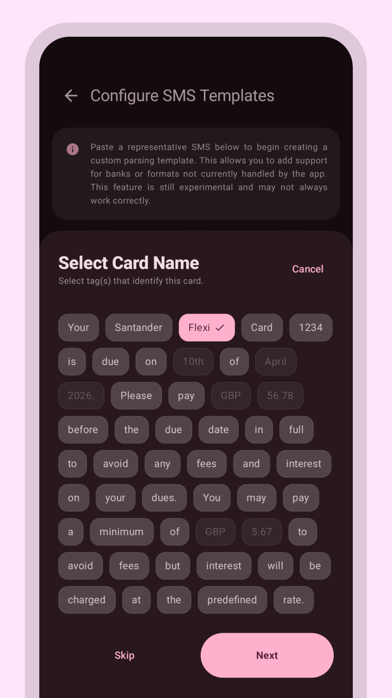
  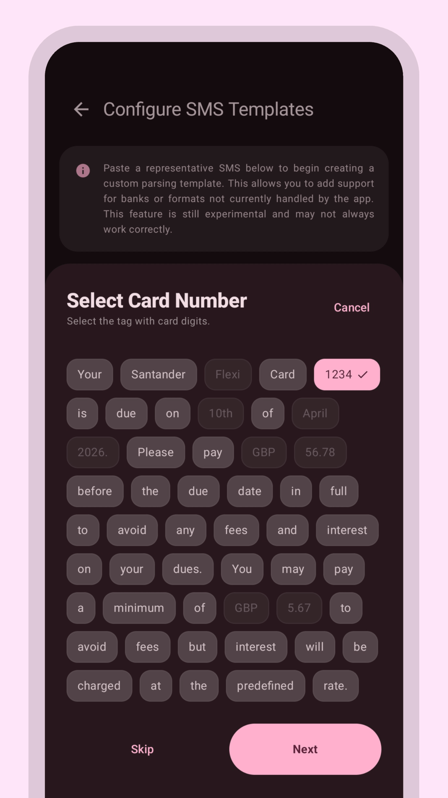
  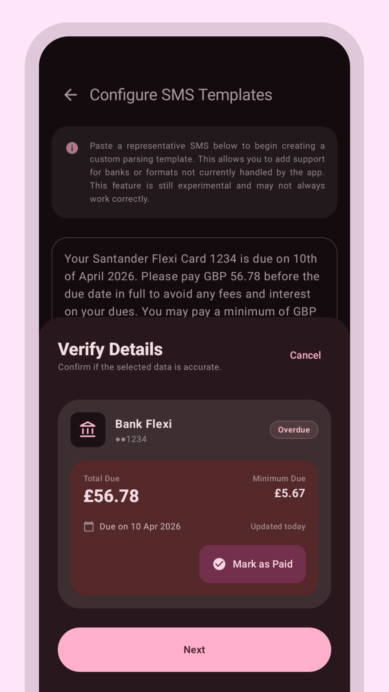
  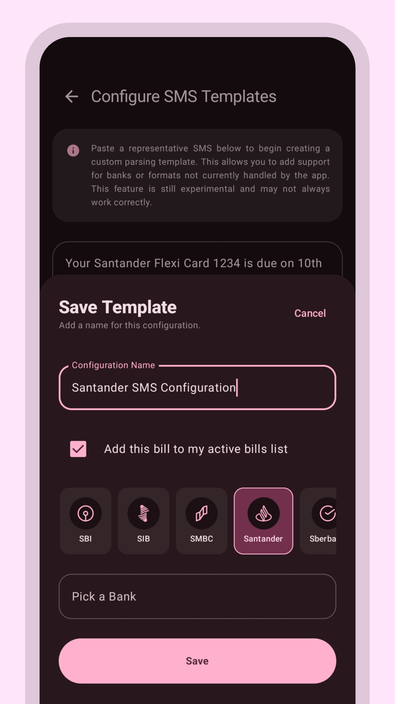
  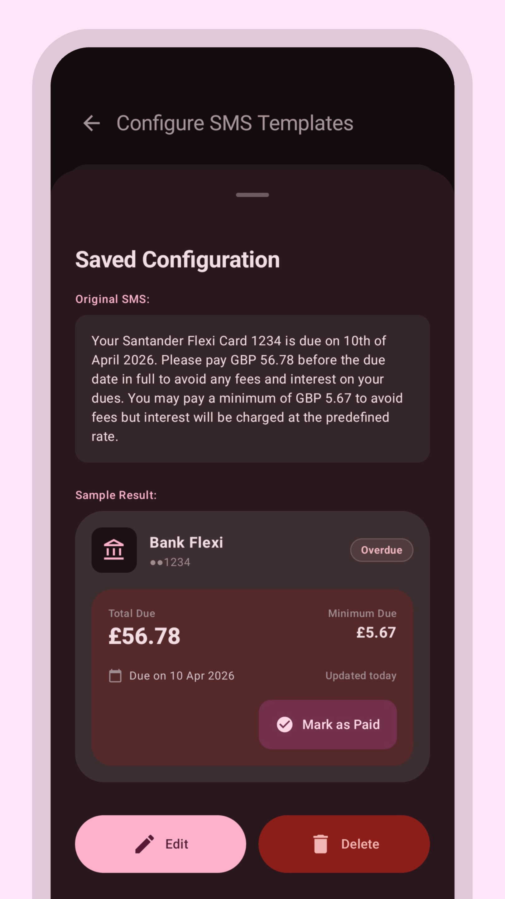
  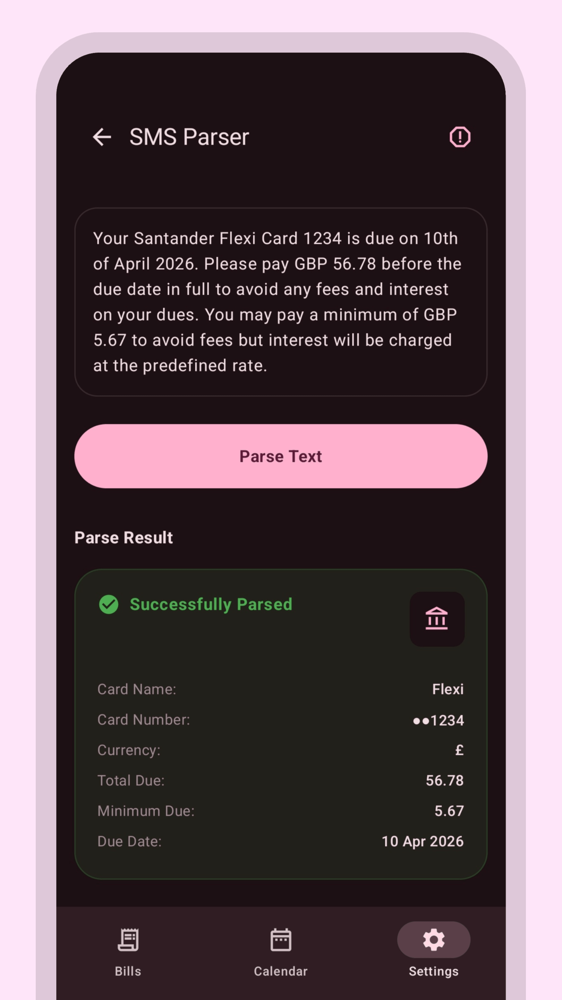

 

---

## Frequently Asked Questions (FAQ)

### Privacy & Security

#### Q: Is my financial data uploaded to any server? 
> No. DueDate is a strictly offline app. Your bill amounts, due dates, and bank names never leave your physical device. We do not have a server, and the app does not require an internet connection to function.
#### Q: Does the app read all my personal SMS messages? 
> No. The app uses an on-device filter to scan through messages from specific Bank/Credit Card sender IDs. Your personal conversations are ignored and never processed.
#### Q: Why does the app need "Post Notifications" permission? 
> This is required to alert you when a new bill is detected and to send you payment reminders so you can avoid late fees.

 

### Bill Detection

#### Q: A bill was delivered to my SMS inbox, but DueDate didn't see it. Why? 
> This usually happens for two reasons:
> 1. Background Restrictions: Your phone's battery saver might have killed the app. Please ensure Autostart is ON (See [Section 6](#enabling-autostart-xiaomi-redmi-poco)).
> 2. New SMS Format: Banks occasionally change their message wording. You can now fix this yourself! Paste the SMS into the Bill Parser `Settings > Database > Bill Parser` and use the Configure button to "teach" the app the new format. You can also use the Report button to send us the format so we can add native support.
#### Q: Does DueDate support utility bills (Electricity, Water, Gas and Internet)? 
> Currently, DueDate is optimized specifically for Credit Card and Bank statements. 
#### Q: Can I manually add a bill if I don't have an SMS? 
> Currently, DueDate requires the bill's SMS text to ensure data accuracy and automation. If you have the text, paste it into the Bill Parser (`Settings > Database > Bill Parser`), tap Parse Text, and then use the Add Bill button. This will run the bill through our standard pipeline, including duplicate checks and reminder scheduling. Full manual entry without an SMS is still on our roadmap.

 

### Database & Backups

#### Q: If I uninstall the app, will I lose my data? 
> Yes. Since there is no cloud sync, uninstalling the app deletes the local database. Always perform a Local Backup (`Settings > Backup > Export Data`) before uninstalling or switching phones.
#### Q: What is the backup file?
> When you export your data, DueDate creates a `.ddb` file containing a list of your settings and bill details. This file is *not encrypted* and contains basic information extracted from SMS like bank names, the last 4 digits of card numbers, and bill amounts. It is designed to be easily portable, so you can move your data to a new device using the DueDate app.
#### Q: I found a bug or have a feature request. How do I contact you? 
> We value your feedback! You can reach out directly at mateyouapps@gmail.com or mateyou@tuta.io (Tuta inbox is less frequently monitored). Please include your device model if you are reporting a technical glitch.

 

### Troubleshooting

#### Q: I am not being notified about new bills even though I get bank messages. 
> Ensure the 'Bill Detection' notification toggle is ON in `Settings > Notifications`. Also, check if you have a third-party 'SMS Organizer' or 'Spam Filter' app that might be intercepting messages before DueDate can see them.
#### Q: Why does the 'Scheduler Log' say a reminder was 'Skipped'? 
> This is a feature, not a bug! If you pay a bill early and mark it as 'Paid' in the app, the system automatically skips any upcoming reminders for that specific bill to avoid annoying you with unnecessary notifications.

 

---

### Updates to this page
April 06, 2026      -   First Created

April 07, 2026      -   Added Widgets

April 09, 2025      -   Added Experimental Feature

April 10, 2025      -   Added Screenshots for the Quick Start Guide and the Manage Banks feature

April 11, 2025      -   Added Screenshots for the experimental Configure SMS Templates feature

 
